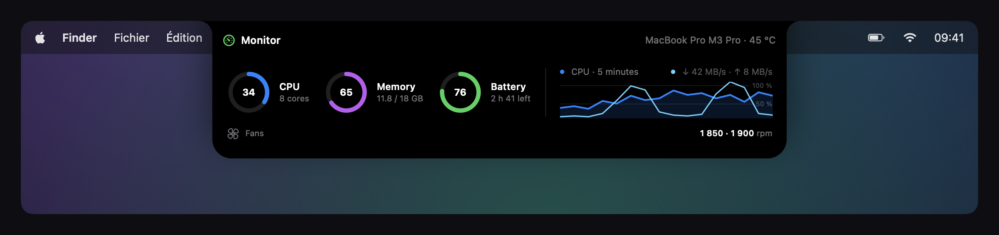

> [!IMPORTANT]
> **First launch: no Apple Developer ID signature**
> Golden Notch is not signed with an Apple Developer ID certificate and is not notarized by Apple. macOS may therefore block its first launch because it cannot verify the developer or check the app through Apple's notarization service.
>
> If you downloaded Golden Notch from [this repository's releases](https://github.com/pierreburnn/golden-notch-releases/releases/latest) and choose to trust it, first try opening the app, then go to **System Settings → Privacy & Security → Open Anyway** and confirm. This permission is separate from the camera, calendar and other feature permissions requested inside the app. [Apple's explanation](https://support.apple.com/en-us/102445).

# Golden Notch

English · [🇫🇷 Lire en français](README.fr.md)

### Your notch. Your everyday, within reach.

Media controls, weather, calendar, clipboard and everyday tools — in your Mac’s notch.

**Early preview · Apple Silicon · French app interface · Built-in updates**

[Explore](#one-place-for-your-day) · [Features](#more-within-reach) · [Installation & compatibility](#install-golden-notch) · [Feedback](#help-shape-golden-notch)

> These images show the app in demonstration mode, with fictional data and the menu bar set to **09:41**. Actual content depends on your apps, devices and permissions. The app interface is currently in French.

## One place for your day

Golden Notch turns your Mac’s notch into a panel for the things you reach for throughout the day. Check what’s playing, see your next meeting or revisit something you copied. Click to open a module or swipe horizontally to move between them.

The app lives in the menu bar, without a permanent Dock icon. Hover and closing preferences let you adjust how the panel responds.

## Your music and videos, close at hand

Hover to reveal available artwork, title and artist. Open the panel for playback controls, track navigation and progress when supported by the source.

Golden Notch reads macOS Now Playing sessions, with additional integrations for Music and Spotify. Metadata, artwork and controls depend on the app or browser playing the media.

## Copy it. Find it. Use it again.

Keep previous text, links, images and code snippets within reach through clipboard history.

- Open clipboard history with **⌃⌥V** — Control + Option + V.
- Browse with the **left and right arrows**, then press **Return** to reuse the selection.
- **Copier** copies the item and closes the panel. With Accessibility permission, the app can also paste into the previous app; otherwise, press **⌘V** yourself.
- Right-click for **Copier sans fermer** (copy without closing), or remove items from history.

## Weather where you are

See the current temperature, feels-like temperature, precipitation, hourly outlook and forecasts for the coming days. Set a default city or use your Mac’s location as you travel.

The animated background follows the weather and fades into the panel’s black edges. Forecasts use **Météo-France models through Open-Meteo**; a button opens the Météo-France website. Precipitation probabilities, when available, are not a confidence score for the entire forecast.

## Sound, app by app

Adjust individual app volumes alongside the main volume, and access audio output settings and the equalizer.

The mixer requires system audio capture permission. Compatibility depends on the app and the audio features available in your macOS version.

## Your next meeting

Browse the week and your upcoming events. When an event contains a recognized video meeting link, use **Rejoindre** (Join) to open it.

Golden Notch uses the accounts already set up in Calendar on your Mac. You can grant access from the app; events reload after permission is granted.

## Your devices at a glance

See available battery readings for your Mac, compatible AirPods, mice, keyboards and associated mobile devices.

An iPhone can show its battery, **cellular signal bars** and **network type**, such as 5G, when macOS continuity services provide those details.

Hover over the iPhone card to reveal **Partager** (Share), which starts connecting your Mac to that iPhone’s Personal Hotspot.

These two images show the same fictional example, at rest and on hover. The iPhone must be available for Personal Hotspot. Pairing and macOS permissions may be required; signal details and connectivity are not guaranteed for every device.

For iPhone and iPad, an initial USB connection and **Trust This Computer** approval may be necessary before wireless readings work. Available information, including Apple Watch details, depends on the device, pairing and operating system.

## Keep an eye on your MacBook Pro

Check **CPU activity**, **memory usage**, **battery** and **network activity** from the notch. Follow activity over time in the chart, with the Mac model and its temperature in the header when available.

This demonstration uses a **MacBook Pro M3 Pro**, with two fans running at **1,850 and 1,900 RPM**. Fan speeds appear on supported MacBook Pro models when the sensors are accessible. These are fictional readings; available information depends on the hardware and macOS. The module displays fan speeds; it does not control them.

## More within reach

| Module | What it does |
| :--- | :--- |
| **Home** | Media, week overview, next event and camera mirror access. |
| **Media** | Available metadata and playback controls. |
| **Weather** | Current and upcoming conditions for a city or your location. |
| **Audio mixer** | App volumes, audio output and equalizer. |
| **Clipboard** | Find and reuse previous copied items. |
| **File shelf** | Temporarily hold files to share or move them. |
| **Calendar** | Upcoming events and recognized meeting links. |
| **Mirror** | A camera preview to check your framing before calls. |
| **Batteries** | Battery levels reported by connected devices. |
| **Downloads** | Detected downloads and files in your Downloads folder. |
| **Quick settings** | System controls, volume and brightness. |
| **Monitor** | CPU, memory, battery, network activity and supported MacBook Pro fan readings. |

### A few simple gestures

- **Hover** over the notch for the available preview.
- **Click** to open the panel.
- **Swipe horizontally with two fingers** to switch modules.
- **Drag a file** onto the notch to open the shelf.
- Press **Escape** to close the panel.
- Press **⌃⌥Space** to toggle the panel from the keyboard.

## Install Golden Notch

1. Open the [latest release](https://github.com/pierreburnn/golden-notch-releases/releases/latest) and download **Installer Golden Notch sur Mac (DMG)**.
2. Open the DMG and drag **Golden Notch** into **Applications**.
3. Eject the DMG, then launch the app from Applications.
4. Review the permissions window and grant access to the modules you want to use.

**Compatibility:** the distributed build is for **Apple Silicon** Macs. The app targets **macOS 14.2 or later**, but some bundled libraries and features, particularly mobile device readings, need a newer version. Current validation was performed on **macOS 27 beta**; full functionality on earlier versions is not yet guaranteed. There is currently no Intel build.

**First launch:** this app is not Developer ID signed or notarized by Apple. After checking its source, you may need to use **System Settings → Privacy & Security → Open Anyway**. Permissions may be requested again after an update.

### Updates arrive inside the app

Golden Notch receives regular updates with improvements, fixes and new features. **Your lifetime purchase includes future updates, with no subscription or additional update fee.** Updates are delivered directly through the built-in updater, so you do not need to download and reinstall a new DMG for each release.

When automatic checking is enabled, Golden Notch checks for updates at launch and daily. You can also check manually under **Réglages → Mises à jour → Vérifier maintenant** (Settings → Updates → Check now).

Update archives are checked against an **Ed25519 signature** before extraction. After relaunching, a window shows what changed; release notes also remain available in settings. You do not need a GitHub account or token to download updates.

## Questions

<strong>Which download should I choose?</strong>

Choose the **DMG** for your first installation. The **ZIP** and **appcast.xml** support automatic updates; you do not need to install them manually.

GitHub automatically generates the **Source code (zip / tar.gz)** links. They contain this public repository’s presentation and images, not Golden Notch’s private Swift project.

<strong>Do I need every permission?</strong>

Permissions relate to the features you use: camera for Mirror, calendars for events, location for local weather, system audio capture for the mixer, and so on. The permissions window explains each access and refreshes its status. Some permissions must be changed in System Settings, and macOS does not directly expose every status.

<strong>Why is a media source or device missing?</strong>

Golden Notch depends on information supplied by macOS, apps and devices. A source without a Now Playing session, an accessory that does not report battery levels, or missing permission can limit what appears.

<strong>Is the source code public?</strong>

This repository presents the app and hosts downloads. The main Swift project is private. The app includes third-party components and their licenses or sources, plus some utilities and scripts needed for it to work.

## Coming soon: build your own plug-ins

A **custom plug-in architecture** is planned so you can install extensions you code yourself and personalize Golden Notch with your own tools and modules.

This feature is being prepared and is **not available yet**. Development and installation documentation will be published when it is ready.

## Help shape Golden Notch

Try the preview and tell us which part fits your day — or what needs work. [Open an issue](https://github.com/pierreburnn/golden-notch-releases/issues) with your macOS version, Golden Notch version and steps to reproduce any problem. Avoid including personal information in screenshots.

If Golden Notch is useful to you, a **star on this repository** helps other Mac users discover it.

---

**Your notch. Your everyday, within reach.**

[Download the latest release](https://github.com/pierreburnn/golden-notch-releases/releases/latest) · [Share feedback](https://github.com/pierreburnn/golden-notch-releases/issues) · [Release notes](https://github.com/pierreburnn/golden-notch-releases/releases)

## 7 days free. Then $9.99 for a lifetime license.

**Planned launch offer: try all features for 7 days, with no credit card required. Then unlock Golden Notch with a one-time payment of US$9.99 — no subscription and no automatic charge at the end of the trial.**

**Regular updates are included with your lifetime purchase, directly in the app.**

The store and license activation are being prepared. The current public download is an early preview (v1.4); the 7-day trial and purchase flow will be delivered in a subsequent release. Beta access will be extended if the store is not ready when a trial ends.

### Golden Notch and NotchNook

| Product | One-time purchase |
| :--- | :--- |
| **Golden Notch** | **US$9.99 lifetime license — planned launch price** |
| **NotchNook** | **US$25 listed price** |

NotchNook's price was checked on its [official website](https://lo.cafe/notchnook) on September 8, 2026, excluding promotions; its one-time purchase covers five devices. Prices and applicable taxes may vary. Golden Notch's activation terms will be shown at checkout when the store opens.

Golden Notch brings together **media controls, weather, a per-app audio mixer, clipboard history, calendar, device batteries and Personal Hotspot access**, alongside the other modules described above. This is a description of Golden Notch's features, not a claim that NotchNook lacks each of them.

Golden Notch is an independent app, not affiliated with Apple or NotchNook / lo.cafe.
