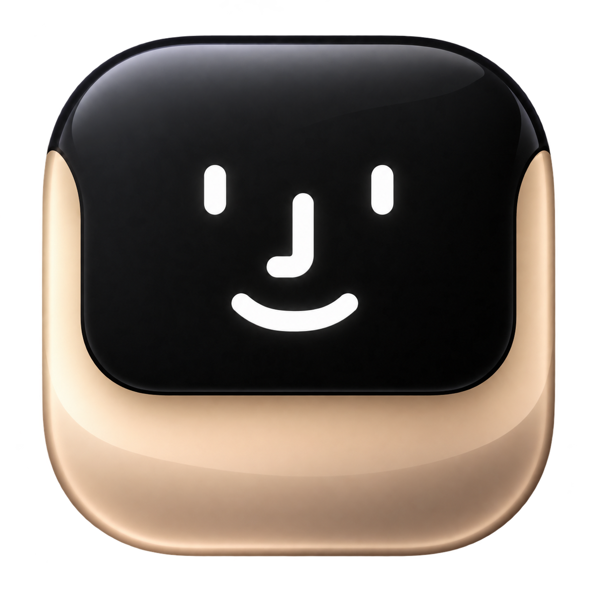
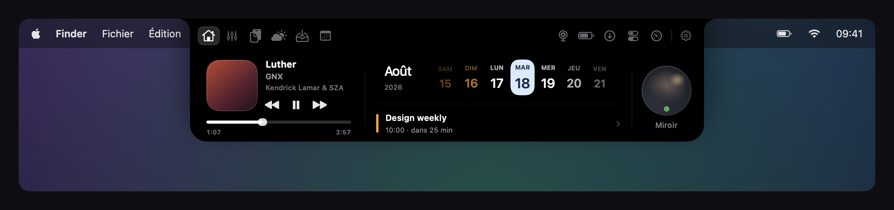
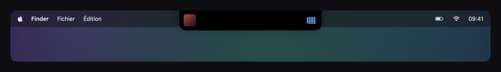
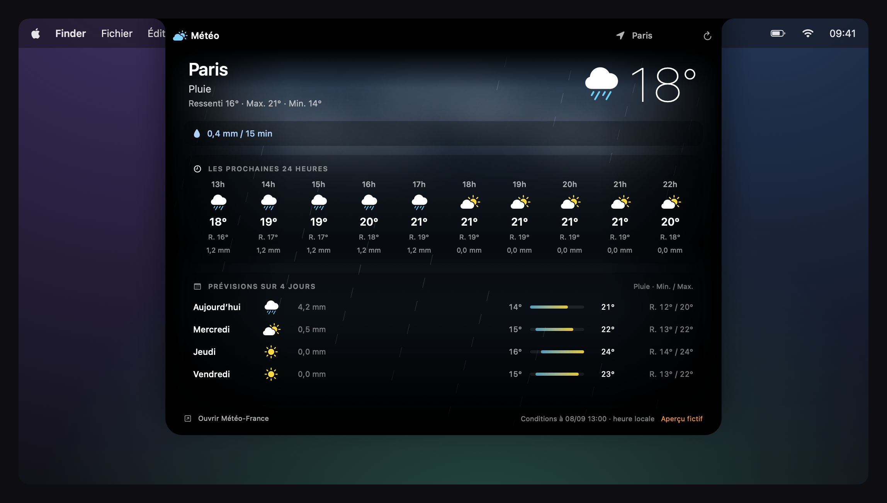
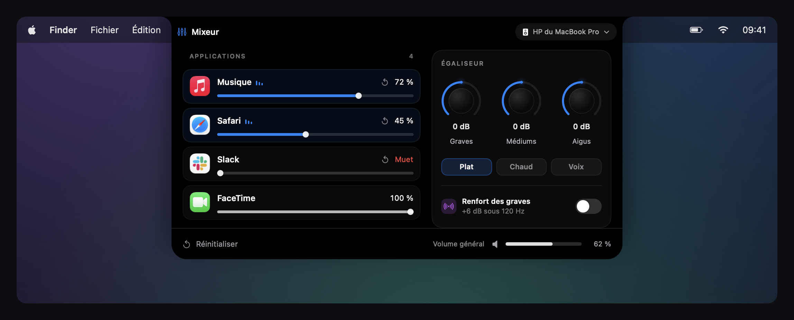
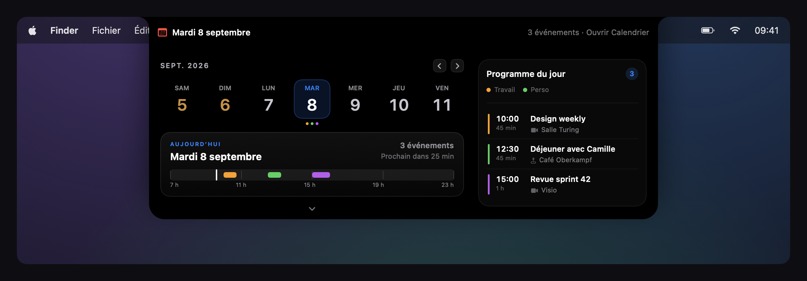
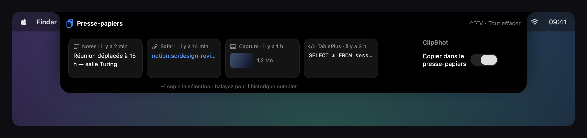
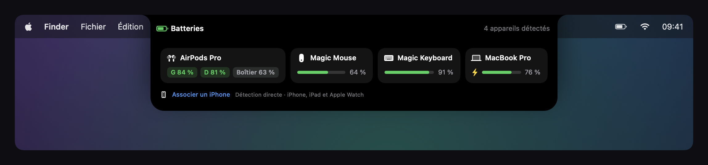
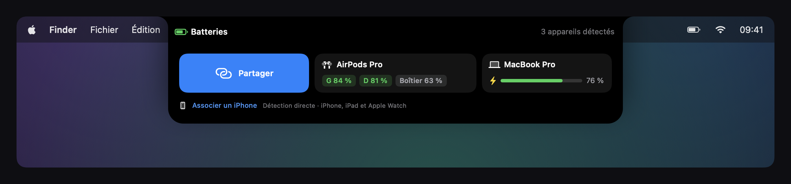
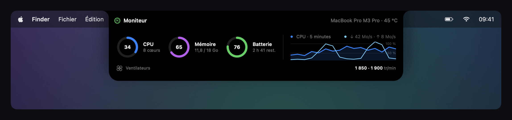

> [!IMPORTANT]
> **Premier lancement : absence de signature Apple Developer ID**
> Golden Notch ne possède pas de signature avec un certificat Apple Developer ID et n'est pas notarisée par Apple. macOS peut donc bloquer son premier lancement, car il ne peut pas vérifier le développeur ni contrôler l'app via le service de notarisation Apple.
>
> Si vous avez téléchargé Golden Notch depuis [les releases de ce dépôt](https://github.com/pierreburnn/golden-notch-releases/releases/latest) et choisissez de lui faire confiance, essayez d'abord d'ouvrir l'app, puis allez dans **Réglages Système → Confidentialité et sécurité → Ouvrir quand même** et confirmez. Cette autorisation est distincte des accès à la caméra, au calendrier et aux autres fonctions demandés dans l'app. [Explications d'Apple](https://support.apple.com/fr-fr/102445).

# Golden Notch

[🇬🇧 Read in English](README.md) · Français

### Votre encoche. Votre quotidien, à portée de main.

Un espace pour vos médias, votre météo, vos événements et les petits gestes du quotidien sur Mac.

*A notch companion for macOS — media controls, weather, calendar, audio mixer and everyday tools.*

**Apple Silicon · Interface en français et anglais · Mises à jour intégrées**

[Découvrir](#un-accueil-pour-votre-journée) · [Fonctionnalités](#tout-ce-qui-vous-accompagne) · [Installer](#installer-golden-notch) · [Questions fréquentes](#questions-fréquentes)

> Visuels de l’interface en mode démonstration, avec des données fictives et une barre de menus à **09:41**. Le contenu réel dépend de vos applications, de vos appareils et des autorisations accordées.

## Un accueil pour votre journée

Golden Notch prolonge l’encoche du Mac avec un panneau qui s’ouvre lorsque vous en avez besoin. Retrouvez la lecture en cours, votre semaine et votre prochain rendez-vous depuis un même endroit. Un clic donne accès aux autres modules ; un balayage horizontal permet de passer de l’un à l’autre.

L’app reste dans la barre des menus, sans icône permanente dans le Dock. Les options de survol et de fermeture permettent d’adapter son comportement à votre façon de travailler.

## Votre musique, vos vidéos, vos commandes

Une pochette, un titre, un artiste : l’aperçu au survol donne accès à la lecture en cours. Depuis le panneau, retrouvez lecture/pause, progression et changement de piste lorsque la source les prend en charge.

Les médias sont récupérés depuis les sessions « En lecture » de macOS, avec des intégrations complémentaires pour Musique et Spotify. La disponibilité du titre, de la pochette et des commandes dépend de l’application ou du navigateur qui diffuse le média.

## La météo, là où vous êtes

Température actuelle, ressenti, précipitations, évolution heure par heure et prévisions des prochains jours : consultez les informations utiles avant de sortir. Choisissez une ville par défaut ou utilisez la position du Mac pendant vos déplacements.

Le fond évolue avec les conditions météo et se fond dans les bords noirs du panneau. Les données utilisent les modèles **Météo-France via Open-Meteo** ; un bouton ouvre le site Météo-France. Les probabilités de précipitations, lorsqu’elles sont disponibles, ne constituent pas un indice de fiabilité de toutes les prévisions.

## Le son, application par application

Ajustez le volume de vos applications depuis le mixeur, en complément du volume général. Retrouvez aussi les réglages de sortie audio et l’égaliseur.

Le mixeur nécessite l’autorisation de capture audio système. La compatibilité dépend des applications et des fonctions audio disponibles sur votre version de macOS.

## Vos prochains rendez-vous

Parcourez les jours de la semaine et consultez les événements à venir. Lorsqu’un événement contient un lien de visioconférence reconnu, le bouton **Rejoindre** permet d’ouvrir la réunion.

Le calendrier utilise les comptes déjà configurés dans Calendrier sur le Mac. L’accès se demande depuis l’app ; les événements se rechargent après l’accord de l’autorisation.

## Copier, retrouver, coller

Gardez vos copies à portée de main : textes, liens, images et extraits de code apparaissent dans l’historique du presse-papiers. Retrouvez un élément précédent pour le réutiliser sans retourner le chercher dans son application d’origine.

- Ouvrez le presse-papiers avec **⌃⌥V** — Contrôle + Option + V.
- Parcourez les éléments avec les **flèches gauche et droite**, puis utilisez **Entrée** pour réutiliser la sélection.
- Le bouton **Copier** remet l’élément dans le presse-papiers et ferme le panneau. Avec l’autorisation **Accessibilité**, l’app peut aussi le coller automatiquement dans l’application précédente ; sinon, terminez avec **⌘V**.
- Un clic droit donne accès à **Copier sans fermer**. Vous pouvez aussi supprimer les éléments de l’historique.

## Vos appareils, d’un coup d’œil

Consultez les niveaux de batterie disponibles pour le Mac et ses accessoires. Les AirPods, souris et claviers compatibles peuvent apparaître aux côtés des appareils mobiles associés.

L’iPhone peut afficher sa batterie, les **barres de signal cellulaire** et le **type de réseau**, comme la 5G dans cet exemple. Ces informations apparaissent lorsqu’elles sont communiquées par les services de continuité de macOS.

### Le partage de connexion depuis l’encoche

Survolez la carte de l’iPhone pour faire apparaître le bouton **Partager**. Il permet de lancer la connexion du Mac au partage de connexion de cet iPhone.

Ces deux vues montrent le même exemple fictif : la carte au repos, puis au survol. L’iPhone doit être disponible pour le partage de connexion ; l’association des appareils et les autorisations macOS peuvent être nécessaires. Le signal réseau et la connexion ne sont pas garantis pour tous les appareils.

Pour l’iPhone et l’iPad, une première association USB avec « Faire confiance » peut être nécessaire avant les lectures sans fil. Les informations disponibles, notamment pour l’Apple Watch, dépendent de l’appareil, de son association et de la version du système.

## Votre MacBook Pro, sous surveillance

Gardez un œil sur l'activité du **CPU**, l'utilisation de la **mémoire**, la **batterie** et le **réseau** depuis l'encoche. Le graphique permet de suivre l'évolution de l'activité, tandis que l'en-tête indique le modèle du Mac et sa température lorsqu'elle est disponible.

Cet exemple de démonstration montre un **MacBook Pro M3 Pro**, avec deux ventilateurs à **1 850 et 1 900 tr/min**. Les vitesses des ventilateurs s'affichent sur les MacBook Pro compatibles lorsque les capteurs sont accessibles. Les valeurs sont fictives ; les informations disponibles dépendent du matériel et de macOS. Ce module affiche les vitesses, sans régler les ventilateurs.

## Tout ce qui vous accompagne

| Fonction | Ce que vous pouvez faire |
| :--- | :--- |
| **Accueil** | Retrouver les médias, la semaine, le prochain événement et l’accès au miroir. |
| **Médias** | Consulter les métadonnées disponibles et piloter la lecture. |
| **Météo** | Voir température, ressenti et précipitations ; suivre une ville ou votre position. |
| **Mixeur** | Ajuster le volume par application, la sortie et l’égaliseur. |
| **Presse-papiers** | Retrouver les éléments copiés et les réutiliser rapidement. |
| **Étagère de fichiers** | Déposer temporairement des fichiers puis les partager ou les déplacer. |
| **Calendrier** | Parcourir les événements à venir et ouvrir les liens de réunion reconnus. |
| **Miroir** | Vérifier votre cadrage avec un aperçu caméra avant un appel. |
| **Batteries** | Consulter les charges que les appareils connectés rendent disponibles. |
| **Téléchargements** | Suivre les fichiers et téléchargements détectés dans le dossier Téléchargements. |
| **Réglages rapides** | Accéder aux commandes système, au volume et à la luminosité. |
| **Moniteur** | Consulter le CPU, la mémoire, la batterie, le réseau et les ventilateurs des MacBook Pro compatibles. |

### Des gestes simples

- **Survolez** l’encoche pour afficher l’aperçu disponible.
- **Cliquez** pour ouvrir le panneau.
- **Balayez horizontalement à deux doigts** pour naviguer entre les modules.
- **Glissez un fichier** sur l’encoche pour ouvrir l’étagère.
- Appuyez sur **Échap** pour fermer le panneau.
- Utilisez **⌃⌥Espace** pour ouvrir ou fermer le panneau au clavier.

## Installer Golden Notch

1. Ouvrez la [dernière version](https://github.com/pierreburnn/golden-notch-releases/releases/latest) et téléchargez **Installer Golden Notch sur Mac (DMG)**.
2. Ouvrez le DMG et glissez **Golden Notch** dans **Applications**.
3. Éjectez le DMG, puis lancez l’app depuis Applications.
4. Parcourez la fenêtre des autorisations et accordez les accès aux modules que vous souhaitez utiliser.

**Compatibilité :** la version distribuée est destinée aux Mac **Apple Silicon**. L’application cible macOS **14.2 minimum**, mais certaines bibliothèques et fonctions, notamment la lecture des appareils mobiles, nécessitent une version plus récente. La validation actuelle a été effectuée sur **macOS 27 bêta** ; le fonctionnement complet sur les versions antérieures n’est pas encore garanti. Aucune version Intel n’est proposée actuellement.

**Premier lancement :** l’application n’est pas signée Developer ID ni notarisée par Apple. Après avoir vérifié sa provenance, vous pouvez avoir besoin de passer par **Réglages Système → Confidentialité et sécurité → Ouvrir quand même**. Les autorisations peuvent être redemandées après une mise à jour.

Depuis la version **1.6.1**, les données d’essai et de licence sont conservées localement sans accès au trousseau et sans demande de mot de passe Mac pour le compte. Une mise à jour depuis 1.6 démarre un nouvel essai de 7 jours. La vérification des licences passe par Lemon Squeezy lorsque la boutique est configurée.

### Les versions suivantes arrivent dans l’app

Golden Notch reçoit régulièrement des mises à jour pour apporter des améliorations, des corrections et de nouvelles fonctionnalités. **L’achat à vie inclut les mises à jour futures, sans abonnement ni supplément.** Elles sont proposées directement dans l’application via le système de mise à jour intégré, sans devoir télécharger et réinstaller un nouveau DMG à chaque version.

Lorsque la recherche automatique est activée, Golden Notch vérifie les mises à jour au lancement puis chaque jour. Vous pouvez aussi lancer une recherche dans **Réglages → Mises à jour → Vérifier maintenant**.

Les archives sont vérifiées avec une signature **Ed25519** avant leur extraction. Après le redémarrage, une fenêtre présente les nouveautés de la version ; elles restent consultables dans les réglages. Aucun compte GitHub ni token n’est nécessaire pour télécharger les mises à jour.

## Questions fréquentes

<strong>Quel fichier dois-je télécharger ?</strong>

Le **DMG** pour une première installation. Le **ZIP** et **appcast.xml** sont utilisés par la mise à jour automatique : vous n’avez pas à les installer manuellement.

Les liens **Source code (zip / tar.gz)** sont générés par GitHub. Ils contiennent la présentation et les visuels de ce dépôt public, pas le projet Swift privé de Golden Notch.

<strong>Dois-je accepter toutes les autorisations ?</strong>

Les accès sont liés aux fonctions utilisées : caméra pour le miroir, calendriers pour l’agenda, localisation pour la météo locale, capture audio pour le mixeur, etc. La fenêtre explique chaque accès et actualise son statut. Certaines autorisations doivent être modifiées dans Réglages Système et certains statuts ne sont pas exposés directement par macOS.

<strong>Pourquoi un média ou un appareil n’apparaît-il pas ?</strong>

Golden Notch dépend des informations publiées par macOS, les applications et les appareils. Une source qui ne publie pas de session média, un accessoire qui ne communique pas sa batterie ou une autorisation manquante peut limiter l’affichage.

<strong>Le code est-il public ?</strong>

Ce dépôt présente l’application et héberge ses téléchargements. Le projet Swift principal est privé. L’application embarque des composants tiers et leurs licences ou sources, ainsi que certains utilitaires et scripts nécessaires à son fonctionnement.

## Bientôt : vos propres plug-ins

Une **architecture de plug-ins personnalisés** est prévue pour permettre d'installer des extensions que vous codez vous-même et de personnaliser davantage Golden Notch avec vos propres outils et modules.

Cette fonction est en préparation et **n'est pas encore disponible**. La documentation de développement et d'installation sera publiée lorsqu'elle sera prête.

## Faire grandir Golden Notch

Une idée, un bug ou un comportement à améliorer ? [Ouvrez un ticket](https://github.com/pierreburnn/golden-notch-releases/issues) avec votre version de macOS, la version de Golden Notch et les étapes pour reproduire le problème. Évitez d’inclure des informations personnelles dans vos captures.

Si Golden Notch vous est utile, une **étoile sur ce dépôt** aide d’autres utilisateurs de Mac à le découvrir.

---

**Golden Notch — les petits gestes du quotidien, à portée d’encoche.**

[Télécharger la dernière version](https://github.com/pierreburnn/golden-notch-releases/releases/latest) · [Signaler un problème](https://github.com/pierreburnn/golden-notch-releases/issues) · [Nouveautés](https://github.com/pierreburnn/golden-notch-releases/releases)

## 7 jours gratuits. Puis 9,99 $ pour une licence à vie.

**Offre prévue au lancement : essayez toutes les fonctionnalités pendant 7 jours, sans carte bancaire. Débloquez ensuite Golden Notch pour un paiement unique de 9,99 $ US — sans abonnement et sans prélèvement automatique à la fin de l'essai.**

**Mises à jour régulières incluses dans l’achat à vie, directement dans l’application.**

La boutique et l'activation des licences sont en préparation. Le téléchargement public actuel (v1.6.1) inclut l'essai de 7 jours et la section Compte. L'achat et l'activation des licences restent désactivés jusqu'au raccordement de la boutique. L'accès bêta sera prolongé si la boutique n'est pas prête à la fin d'un essai.

### Golden Notch et NotchNook

| Application | Achat unique |
| :--- | :--- |
| **Golden Notch** | **Licence à vie à 9,99 $ US — tarif prévu au lancement** |
| **NotchNook** | **Prix affiché : 25 $ US** |

Prix de NotchNook vérifié sur son [site officiel](https://lo.cafe/notchnook) le 8 septembre 2026, hors promotions ; son achat unique couvre cinq appareils. Les prix et taxes applicables peuvent varier. Les conditions d'activation de Golden Notch seront indiquées au paiement lors de l'ouverture de la boutique.

Golden Notch réunit **commandes multimédias, météo, mixeur audio par application, historique du presse-papiers, calendrier, batteries des appareils et accès au partage de connexion**, ainsi que les autres modules présentés plus haut. Cette liste décrit Golden Notch, sans affirmer que chacune de ces fonctions est absente de NotchNook.

Golden Notch est une application indépendante, sans affiliation avec Apple ou NotchNook / lo.cafe.
